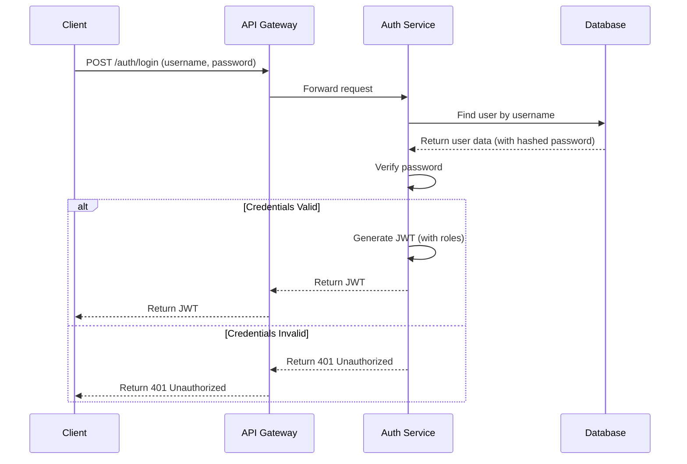

# Sazzler Auth Service

## 1. Overview
The **Sazzler Auth Service** is a microservice responsible for handling all user authentication and authorization within the Sazzler ecosystem. It manages user registration, login, and the issuance of JSON Web Tokens (JWTs) for securing communication between clients and other microservices.

It uses Spring Security to implement a robust security framework, including password hashing and role-based access control (RBAC).

## 2. Architecture

### 2.1. Authentication Flow
The Auth Service orchestrates the login process. When a user logs in, it validates their credentials, and if successful, generates a JWT that the client can use to access other services.



### 2.2. Key Components
- **`User` Model:** Represents user data, including username, hashed password, and roles.
- **`UserRepository`:** A Spring Data repository for database interactions (e.g., MongoDB).
- **`UserDetailsService`:** Loads user-specific data from the database.
- **`AuthenticationManager`:** The core of Spring Security's authentication mechanism.
- **`JwtUtil`:** A utility class for creating and validating JWTs.
- **`AuthController`:** Exposes REST endpoints for `/login` and `/register`.

## 3. Features
- **User Registration:** Securely registers new users with hashed passwords.
- **User Login:** Authenticates users and provides a JWT upon success.
- **JWT Generation:** Creates stateless, signed JWTs containing user identity and roles.
- **Password Encryption:** Uses BCrypt to securely store user passwords.
- **Role-Based Access Control (RBAC):** Assigns roles to users, which are embedded in the JWT for downstream authorization.
- **Service Discovery:** Registers with the Eureka Service Registry.

## 4. Setup and Configuration

### 4.1. Prerequisites
- Java 21+
- Gradle 8.x+
- A running instance of the **Sazzler Service Registry**.
- A running database instance (e.g., MongoDB).

### 4.2. Build & Run
```bash
# Build the project
./gradlew build

# Run the application
./gradlew bootRun
```
The service starts on port `8081` by default.

### 4.3. Configuration (`application.yaml`)
```yaml
server:
  port: 8081

spring:
  application:
    name: sazzler-auth-service
  # Database configuration (e.g., MongoDB)
  data:
    mongodb:
      uri: mongodb://localhost:27017/sazzler-auth-db

# Eureka client configuration
eureka:
  client:
    service-url:
      defaultZone: http://localhost:8761/eureka/

# JWT configuration
jwt:
  secret: your-super-secret-key
  expiration: 86400000 # 24 hours in milliseconds
```

## 5. API Endpoints
- **`POST /auth/register`**: Register a new user.
  - **Request Body:** `{ "username": "test", "password": "password", "email": "test@example.com" }`
- **`POST /auth/login`**: Authenticate and receive a JWT.
  - **Request Body:** `{ "username": "test", "password": "password" }`
  - **Success Response:** `{ "token": "ey..." }`

## 6. Docker

### 6.1. Build Docker Image
```bash
docker build -t sazzler-auth-service .
```

### 6.2. Run Docker Container
```bash
docker run -p 8081:8081 \
  -e SPRING_DATA_MONGODB_URI=mongodb://mongo-host:27017/sazzler-auth-db \
  -e EUREKA_CLIENT_SERVICEURL_DEFAULTZONE=http://eureka-host:8761/eureka/ \
  -e JWT_SECRET=your-super-secret-key \
  sazzler-auth-service
```
*Replace `mongo-host` and `eureka-host` with the appropriate hostnames.*

## 7. Troubleshooting
- **Registration/Login Fails:**
    - Ensure the database is running and the connection URI in `application.yaml` is correct.
    - Check the service logs for database connection errors.
- **JWT Validation Fails in API Gateway:**
    - Verify that the `jwt.secret` is identical in both the Auth Service and the API Gateway.
- **Service not appearing in Eureka:**
    - Confirm the `eureka.client.service-url.defaultZone` is correct and the Eureka server is reachable.
